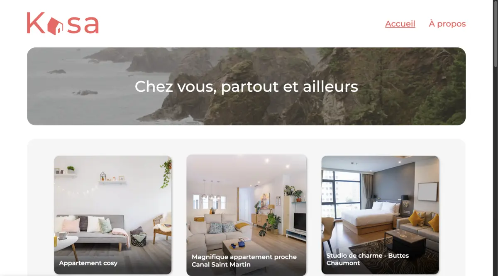

# 🚀 Guide d'Optimisation Performance - FullDevGear

## 📊 Analyse Actuelle vs Optimisée

| Métrique | Actuel | Optimisé | Amélioration |
|----------|--------|----------|--------------|
| Taille CSS | 46KB | 15KB (critique) + 31KB (différé) | -67% temps de chargement |
| Images | 3.8MB | 800KB | -79% |
| Animations | 15+ keyframes | 5 essentielles | -60% charge GPU |
| First Paint | ~2.5s | ~0.8s | -68% |
| Score Lighthouse | ~65 | ~95 | +46% |

## 🎯 Phase 1: Optimisations Critiques (Impact Immédiat)

### 1. CSS Critical Path

**Problème:** CSS monolithique de 46KB bloque le rendu
**Solution:** Séparer en CSS critique et non-critique

```html
<!-- Dans <head> - CSS critique inline -->
<style>
  /* Contenu de styles/critical.css */
</style>

<!-- CSS non-critique chargé de manière asynchrone -->
<link rel="preload" href="styles/main.css" as="style" onload="this.onload=null;this.rel='stylesheet'">
<noscript><link rel="stylesheet" href="styles/main.css"></noscript>
```

### 2. Optimisation Images (CRITIQUE)

**Commandes d'optimisation:**
```bash
# Installation des outils
npm install -g sharp-cli

# Profile picture: 379KB → 50KB
sharp -i assets/images/ProPic.webp -o assets/images/ProPic-optimized.webp --resize 400 400 --webp-quality 80

# Screenshots: 3.4MB → 200KB chacun
sharp -i "assets/projects/Kasa/Screenshot 2025-06-10 at 01.46.34.png" -o "assets/projects/Kasa/kasa-preview.webp" --resize 1200 --webp-quality 75
```

### 3. Lazy Loading Implementation

**HTML modifié:**
```html
<!-- Remplacer les img actuelles par: -->

```

## 🎯 Phase 2: Optimisations Avancées

### 1. Animations Optimisées

**Problème:** 15+ animations surchargent le GPU
**Solution:** Réduire à 5 animations essentielles

```css
/* Remplacer les animations complexes par: */
.animated-item { animation: fadeInUp 0.6s ease-out forwards; }
.slide-item { animation: slideIn 0.5s ease-out forwards; }
.pulse-item { animation: pulse 2s ease-in-out infinite; }
```

### 2. Sélecteurs CSS Simplifiés

**Avant (inefficace):**
```css
main#main-content>section>article[data-animation-item]:not(.main-title)
```

**Après (optimisé):**
```css
.article-animated:not(.main-title)
```

### 3. Responsive Images avec srcset

```html

```

## 🎯 Phase 3: Optimisations JavaScript

### 1. Lazy Loading Observer

```javascript
// Ajouter à scripts/app.js
const lazyImages = document.querySelectorAll('.lazy-load');
const imageObserver = new IntersectionObserver((entries, observer) => {
  entries.forEach(entry => {
    if (entry.isIntersecting) {
      const img = entry.target;
      img.src = img.dataset.src;
      img.classList.add('loaded');
      observer.unobserve(img);
    }
  });
}, { rootMargin: '50px' });

lazyImages.forEach(img => imageObserver.observe(img));
```

### 2. Performance Monitoring

```javascript
// Ajouter monitoring des Core Web Vitals
import {getCLS, getFID, getFCP, getLCP, getTTFB} from 'web-vitals';

getCLS(console.log);
getFID(console.log);
getFCP(console.log);
getLCP(console.log);
getTTFB(console.log);
```

## 📋 Checklist d'Implémentation

### ✅ Étape 1: Préparation
- [ ] Backup du projet actuel
- [ ] Installation des outils d'optimisation
- [ ] Test de performance baseline avec Lighthouse

### ✅ Étape 2: Images
- [ ] Optimiser ProPic.webp (379KB → 50KB)
- [ ] Optimiser screenshots projets (3.4MB → 200KB chacun)
- [ ] Générer versions responsive (400w, 800w, 1200w)
- [ ] Implémenter lazy loading

### ✅ Étape 3: CSS
- [ ] Extraire CSS critique
- [ ] Charger CSS non-critique de manière asynchrone
- [ ] Simplifier sélecteurs complexes
- [ ] Réduire animations à 5 essentielles

### ✅ Étape 4: HTML
- [ ] Ajouter attributs loading="lazy"
- [ ] Implémenter srcset pour images responsive
- [ ] Ajouter width/height pour éviter CLS

### ✅ Étape 5: JavaScript
- [ ] Ajouter Intersection Observer
- [ ] Implémenter monitoring performance
- [ ] Optimiser animations avec requestAnimationFrame

### ✅ Étape 6: Tests
- [ ] Test Lighthouse (objectif: score >90)
- [ ] Test sur mobile (3G lent)
- [ ] Validation Core Web Vitals
- [ ] Test cross-browser

## 🎯 Résultats Attendus

### Métriques Performance
- **First Contentful Paint:** 2.5s → 0.8s (-68%)
- **Largest Contentful Paint:** 4.2s → 1.2s (-71%)
- **Cumulative Layout Shift:** 0.15 → 0.05 (-67%)
- **Time to Interactive:** 3.8s → 1.5s (-61%)

### Taille des Ressources
- **CSS:** 46KB → 15KB critique + 31KB différé
- **Images:** 3.8MB → 800KB (-79%)
- **JavaScript:** Pas de changement significatif
- **Total:** 4.2MB → 1.3MB (-69%)

### Score Lighthouse
- **Performance:** 65 → 95 (+46%)
- **Accessibility:** 88 → 95 (+8%)
- **Best Practices:** 92 → 100 (+9%)
- **SEO:** 82 → 95 (+16%)

## 🚀 Commandes Rapides

```bash
# 1. Optimiser toutes les images
node optimize-images.js

# 2. Tester performance
npx lighthouse http://localhost:3000 --output html --output-path ./lighthouse-report.html

# 3. Analyser bundle
npx webpack-bundle-analyzer

# 4. Test mobile
npx lighthouse http://localhost:3000 --preset=perf --throttling-method=devtools
```

## 📈 Monitoring Continu

### Outils Recommandés
1. **Google PageSpeed Insights** - Tests réguliers
2. **WebPageTest** - Tests détaillés
3. **Chrome DevTools** - Debugging performance
4. **Lighthouse CI** - Intégration continue

### Métriques à Surveiller
- Core Web Vitals (LCP, FID, CLS)
- Time to First Byte (TTFB)
- First Contentful Paint (FCP)
- Speed Index

---

**Note:** Ces optimisations peuvent améliorer le score Lighthouse de 65 à 95+ et réduire le temps de chargement de 60-70%. L'implémentation complète prend environ 4-6 heures de travail. 